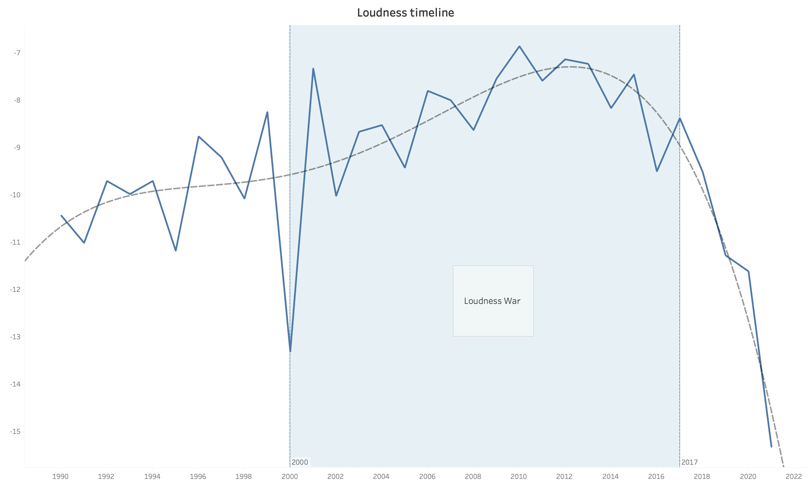

# Music genre analysis and prediction using audio features

   

## Content
  * [Project Intro](#project-intro)
  * [Web Scraping](#web-scraping)
  * [Data Cleaning and Wrangling](#data-cleaning-and-wrangling)
  * [Visual Data Analysis](#visual-data-analysis)
  * [Developing Machine Learning Model to predict the genre of given artist](#developing-machine-learning-model-to-predict-the-genre-of-given-artist)
  * [Conclusion](#conclusion)
  

## Project Intro

### Can machines listen to the music like we do? 
### Human ear can detect frequency and the amplitude of a sound and send this information to the brain. The brain analyzes the input and produces features like tempo, mode, key, etc. That's how we recognize if a song is fast and energetic or slow and sad. 
### Audio Features are mathematical measurements computed directly from the sound wave. Can a machine hear the same? Let's see! 
  

## Web Scraping with Spotipy

+ ### Finding playlists based on genre
+ ### Scraping all artists from playlists
+ ### Scraping all songs from artists
+ ### Getting audio features
  

## Data Cleaning and Wrangling

+ ### Defining genres: Jazz, Rock, Hip-Hop/Rap, Pop, Electronic
+ ### Adding release years
+ ### Loading 152.298 songs in a DataFrame
+ ### Removing duplicates
+ ### Fixing tempo values range from 60 BPM to 200 BPM
   

## Visual Data Analysis

### Keys used in different genres. 
### On guitar and bass easyest keys to play are E, D and A, and that's why these keys are used more in rock music. 
### Brass players prefere F and A#, so these are mosty used in jazz.

   

### Major scales are prevailing, only in 1957 and 1964 were minor scales used more. 
### In 1969 we have a peak usage of majors for the last 70 years.

   

### In the beginning of 21st century as technology evolved it became possible to make the master recording louder without distorsion. But making it louder shrinks the dinamic range. Unfortunatelly many people within the music industry embraced the "the more the merrier" idea and so the loudness war began. Around 2010 things got out of controll resulting so loud albums that fans and music professionals started criticizing. Awareness was raised about the issue arguing that "dynamic music sounds better". Finally by the late 2010s all streaming platforms introduced audio normalization that levels the playback loudness to -14LUFS. That means however your song is loud - in playback won't be louder than others. And so the war ended.

   

### Pop music has a pretty small variance and most of it is between 120-130BPM. Electronic music is a bit slower but with much wider variance a lot of outliers.

   

### Valence and acousticness over time. Valence being how happy and energetic the song is,  and acousticness shows the amount of acoustic instruments played.

   
   

## Machine learning

+ ### Defining Random Forest Classifier model
+ ### Training with 70% of Data
+ ### Predicting
+ ### Checking Accuracy Score
+ ### Using Randomized and Grid search to tune parameters of the model
+ ### Re-training with new parameters
+ ### Predicting
+ ### Final Accuracy Score 87.4%
   

## Conclusion

### Looks like machines can hear in a similar way like we do and recognize types of music. We are still ahead, having our brain trained for millions years of evolution and listening, but machines are training and getting better every day! 